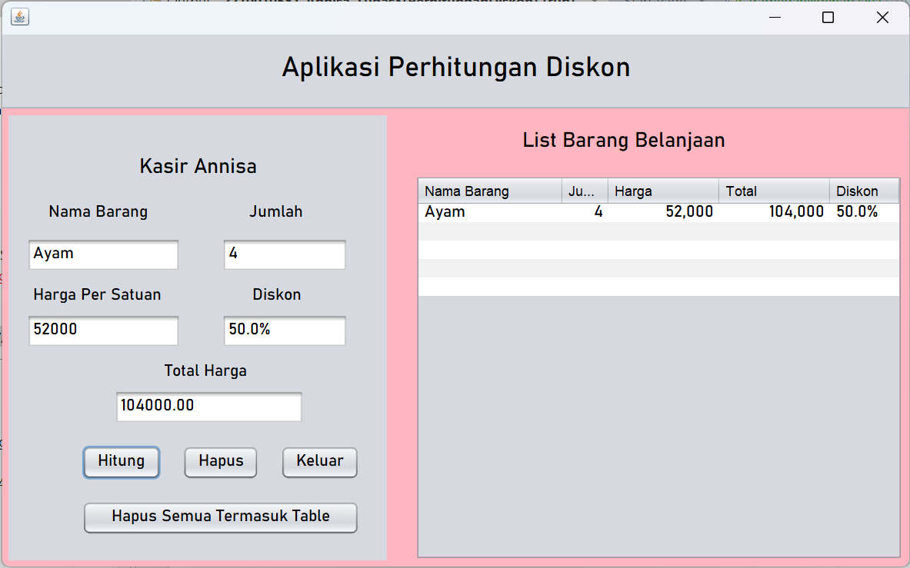

# Aplikasi Perhitungan Diskon
 Tugas 3 - Annisa (2210010581)
 
# Aplikasi Perhitungan Diskon
 
Aplikasi Perhitungan Diskon Adalah Aplikasi untuk menghitung sebuah diskon dari harga

# Keunggulan Aplikasi

- Perhitungan Diskon: Aplikasi ini terdapat diskon

# Pembuat Aplikasi
 Annisa - 2210010581 - Tugas 3

# Fitur

Aplikasi ini menawarkan fitur:

Perhitungan harga dan diskon

## Cara Menjalankan

1. Run File
2. Ketikkan Harga Yang Kita Input
3. Ketikkan jumlah barang 
4. Ketikkan harga satuan barang
5. Tekan Button hitung, maka akan keluar hasilnya
6. Tekan Button hapus, jika ingin mengulang
7. Tekan Button hapus semua tabel, jika ingin menghapus isi di dalam tabel
8. Tekan Button keluar, jika ingin keluar

# Demo
